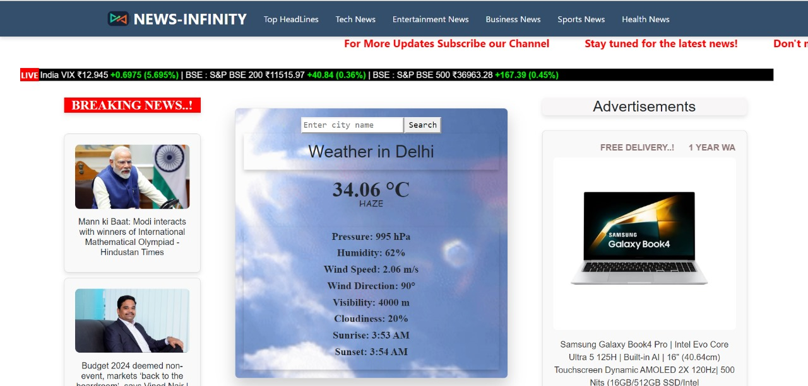
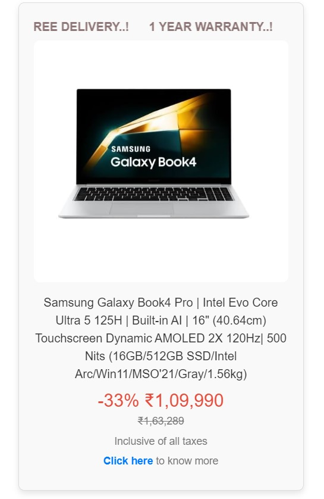
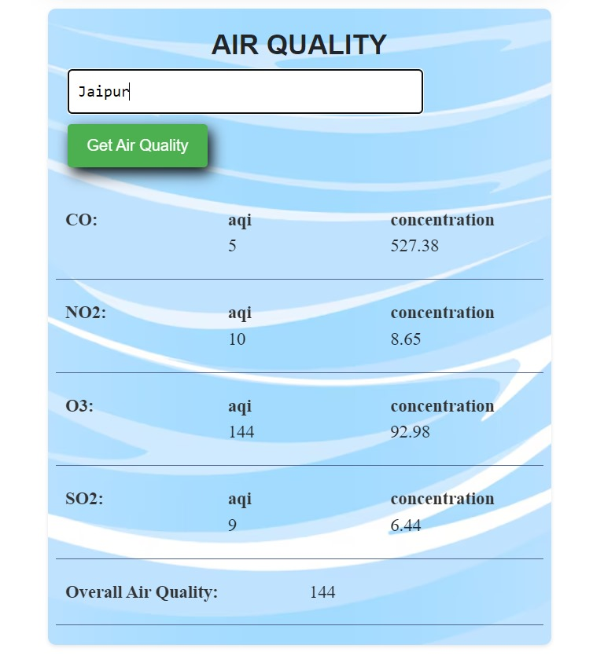

# News Infinity

**News Infinity** is a news channel website that provides top headlines from various official news channels (such as Hindustan Times, NDTV, Times of India, etc.). It also features live climate updates with search functionality for any city worldwide and a marquee displaying live stock updates, obtained through web scraping. The site utilizes APIs from NewsAPI and other platforms.

## Accessing the Website

The website includes APIs from third-party databases that can only be accessed on a local server (http://localhost:4200). To run the website on your local machine, follow these steps:

1. **Download and Extract:**
   - Download the master branch ZIP file.
   - Extract it to your desired location.

2. **Open the Project:**
   - Open the extracted folder in Visual Studio Code. The project directory should look like `C:\Users\users\Downloads\News-Infinity-master\News-Infinity-master`.

3. **Install Dependencies:**
   - Open a terminal in Visual Studio Code.
   - Run the command: `npm install` to install the required Node.js modules.

4. **Serve the Project:**
   - Run the command: `ng serve` to start the development server.
   - Navigate to `http://localhost:4200/` in your browser. The application will automatically reload if you change any of the source files.

## Additional Information

- **Homepage:** Click on the website name (News Infinity) in the top header to land on the homepage.
- **Footer:** The footer contains the 'App Info' section with developer information.
 
## Video Demonstration of News Infinity
You can view or download the [Google Drive File](https://drive.google.com/file/d/1KhuxTchkhaHTrGvUE0xYz3x_leEOszPH/view?usp=sharing) using this link.

## Screenshots

- **Homepage:**
  

- **Advertisement:**
  

- **Logo:**
  

- **Air Quality Panel:**
  

- **Business News Page:**
  

## Developer Information

- **Name:** Divyanshu Lila
- **College:** BITS Pilani, K.K. Birla Goa Campus
- **College ID:** 2022A3PS1056G
- **Contact Number:** 7340001011
- **Email:** divyanshulila11@gmail.com

## Project Setup

- **Development Server:** Run `ng serve` for a dev server.
- **Code Scaffolding:** Use `ng generate component component-name` to generate new components or other Angular entities.
- **Build:** Run `ng build` to build the project. Artifacts will be stored in the `dist/` directory.
- **Unit Tests:** Run `ng test` to execute unit tests via [Karma](https://karma-runner.github.io).
- **End-to-End Tests:** Run `ng e2e` for end-to-end tests (requires an additional package).

## Contributing

Feel free to contribute by submitting issues or pull requests. Please follow the guidelines in `CONTRIBUTING.md`.

## License

This project is licensed under the [MIT License](LICENSE).

## Known Issues

- List any known issues or common troubleshooting steps.

## Changelog

- [Version 1.0.0] Initial release.

## Future Plans

- Add more features or improvements here.

For more help with Angular CLI, use `ng help` or visit the [Angular CLI Overview and Command Reference](https://angular.io/cli).
